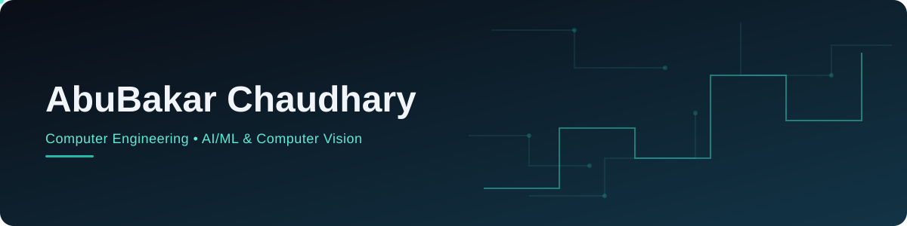

 

---

## About Me

I'm a Computer Engineering student at **NUST CEME** (Batch DE-45, 2023–2027), currently in my 6th semester.

Right now I'm building my Final Year Project, **AI Behavioral Trading Intelligence** — a CV/ML system that reads a trader's screen activity and facial expressions to flag stress and overconfidence in real time. It's a feedback tool for trading discipline, not a market predictor.

Outside of coursework I freelance on Fiverr and Upwork — Python automation, computer vision, Flutter, and database work — and I'm steadily building out an AI/ML project portfolio. Away from the keyboard: volleyball, badminton, the gym, photography, and calligraphy.

---

## Tech Stack

**Languages**
 

**AI / ML & Computer Vision**
 

**Frameworks & Tools**
 

---

## Featured Projects

| Project | What it does | Stack |
|---|---|---|
| **AI Behavioral Trading Intelligence** *(FYP, in progress)* | Reads screen activity and facial expressions to flag a trader's stress and overconfidence, giving real-time feedback to improve trading discipline. |   |
| [Project ALERT](https://github.com/abu-bakarchaudhary/REPO_NAME) | YOLOv8 industrial spill detection — live video sampled every 0.5s, with a 3-interval consecutive-detection check before confirming a spill (yellow = unverified, red = confirmed). |   |
| [NL-to-SQL Desktop Tool](https://github.com/abu-bakarchaudhary/REPO_NAME) | Desktop app that turns plain-English questions into SQL Server queries. |   |
| [NL Spreadsheet Assistant](https://github.com/abu-bakarchaudhary/REPO_NAME) | React app for querying Excel/CSV files in plain English, powered by the Claude API, with folder-level loading and conversation history. |   |
| [Nustified Synapse](https://github.com/abu-bakarchaudhary/REPO_NAME) | Anonymous professor-review platform for NUST CEME — professor-following, email verification, and a notice board. |   |
| [FreelanceHub](https://github.com/abu-bakarchaudhary/REPO_NAME) | End-to-end database engineering project — 21 SQL Server tables, 210+ sample records, views, triggers, and a Flask frontend. |   |

More projects on my [portfolio site](https://abu-bakarchaudhary.github.io/my-portfolio).

---

## GitHub Stats

 

---

## Contribution Activity

<picture>
  <source media="(prefers-color-scheme: dark)" srcset="https://raw.githubusercontent.com/abu-bakarchaudhary/abu-bakarchaudhary/output/github-contribution-grid-snake-dark.svg">
  <source media="(prefers-color-scheme: light)" srcset="https://raw.githubusercontent.com/abu-bakarchaudhary/abu-bakarchaudhary/output/github-contribution-grid-snake.svg">
  
</picture>

*(Needs the one-time GitHub Action in `snake.yml` — see setup note below.)*

---

## Connect

